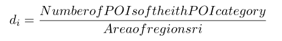

# Topic modeling to discover urban functional regions

We present a novel framework titled FRDwSI to discover urban functional regions. 

In this framework, we use deep-Dirichlet Multinomial Regression (dDMR) topic model to mine the urban functional regions and a semantic recognition method titled SICWK is proposed to identify the semantics of functional regions.

The deepdmr model in dDMR/ was built from here: https://github.com/abenton/deep-dmr. The code of the SICWK method is in the SCIWK/ .

## Data ##

+ The original mobility data are in data/mobility.

  > r11_r1_t9  means people leaving from region *r11* to region *r1* during 9:00 to 9:59 am, mobility_form.py process the original mobility data into mobility pattern data.

+  anndic.txt stores POI feature vector data.
  
  >For the region *r1*, the number of POIs in each POI category can be counted. The frequency density *di* of the *i-th* POI category in region *r1* is calculated by:
  >
  >
  >
  >and the POI feature vector in region *r1* is composed of [*d1,d2,...,dc,1*], where *c* is the number
  >of POI categories and the last ’1’ is the default feature value, which is used to represent
  >the average value of each topic.
  
+  The famous POI data is in SCIWK/famous_poi
  
+ Test data is  in test/test.txt, the label description is as follows:

  > | Label |            Description             |
  > | :---: | :--------------------------------: |
  > |   0   |       catering service areas       |
  > |   1   |        administrative areas        |
  > |   2   | transportation and logistics areas |
  > |   3   |    commercial residential areas    |
  > |   4   |       shopping service areas       |
  > |   5   |    science and education areas     |
  > |   6   |          industrial areas          |
  > |   7   |            scenic spot             |
  > |   8   |          healthcare areas          |
  
  

